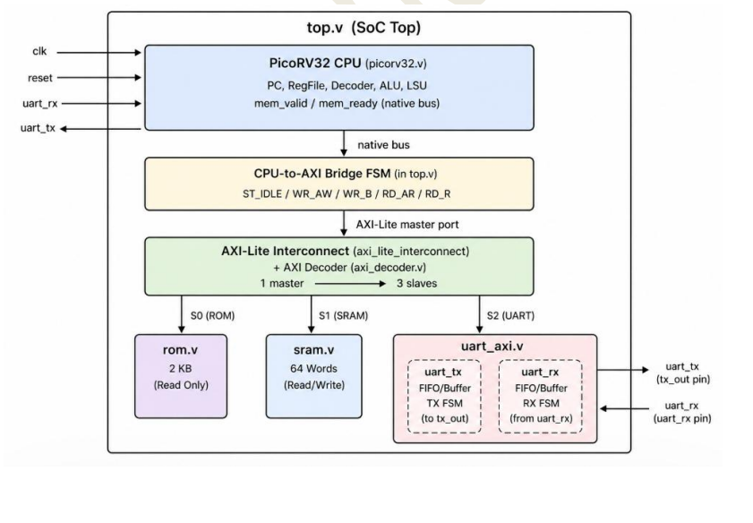
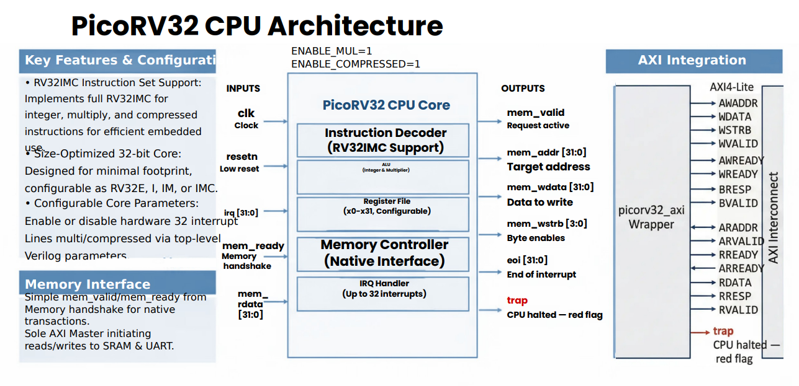

# SoC Architecture

## 1. Overview

This project implements a lightweight RISC-V based embedded System-on-Chip (SoC) integrating a PicoRV32 processor core with an AXI4-Lite interconnect, on-chip memories, and a memory-mapped UART peripheral.

The design demonstrates the complete flow from firmware execution and RTL functional verification to RTL-to-GDSII physical implementation.

## 2. System Architecture

The SoC consists of the following major components:

- PicoRV32 RISC-V processor
- AXI4-Lite master interface
- AXI4-Lite interconnect
- AXI address decoder
- ROM for firmware storage
- SRAM for data storage
- AXI-Lite UART peripheral
- UART transmitter
- UART receiver



## 3. PicoRV32 Processor

PicoRV32 is used as the processor core of the SoC. It executes the firmware stored in ROM and generates memory-mapped read and write accesses to communicate with memories and peripherals.



## 4. AXI4-Lite Interconnect

The AXI4-Lite interconnect provides the communication path between the processor-side master interface and memory-mapped slave devices.

Its primary functions include:

- Routing read and write transactions
- Address-based slave selection
- Transfer of address and data channels
- Routing read and write responses
- Maintaining AXI4-Lite VALID/READY handshaking

## 5. Address Decoder

The address decoder determines the target slave from the processor-generated memory address.

Depending on the decoded address, the transaction is routed to the corresponding memory or peripheral.

```text
                 PicoRV32
                     |
                     v
              AXI-Lite Master
                     |
                     v
             AXI-Lite Interconnect
                     |
                     v
               Address Decoder
                /      |      \
               /       |       \
              v        v        v
             ROM      SRAM     UART
